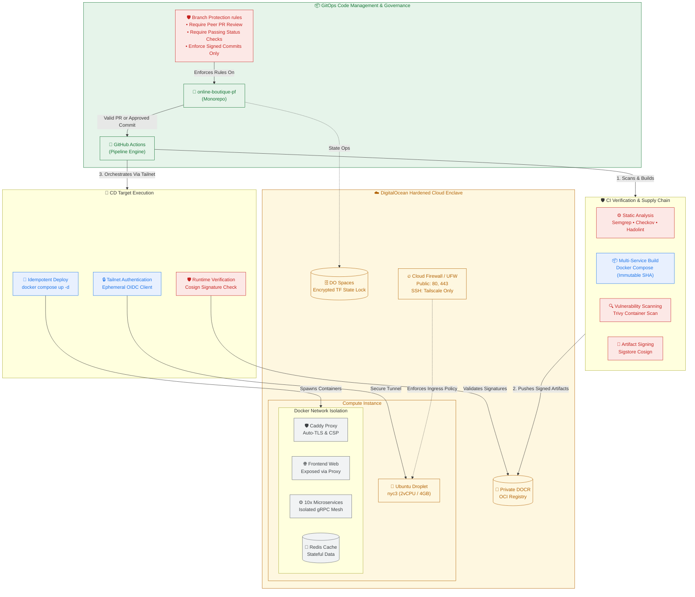

# Online Boutique: Production-Grade DevSecOps Pipeline

A hardened, GitOps-driven deployment of Google's 11-microservice Online Boutique app on DigitalOcean. This project demonstrates enterprise-grade zero-trust security, automated CI/CD hardening, and immutable infrastructure designed for high security and low operational overhead.

## 🛠️ Architecture Highlights

- Zero-Trust Network: Public ingress restricted entirely to HTTPS (443). SSH is fully blocked on the public internet, accessible only via a private Tailscale Mesh VPN.

- Cryptographic Supply Chain: Container images are dynamically signed during CI via `Cosign` and cryptographically verified on the host machine before execution to prevent tampering.

- Container Hardening: Microservices execute using read-only root filesystems, dropped Linux capabilities (`cap_drop: [ALL]`), strict resource quotas, and running as non-root users.

- Isolated Networking: Segmented application layer into two distinct Docker networks (`boutique-net for frontend/gRPC and backend-net for database/caching`) to eliminate lateral movement vectors.

## 🏗️ Technical Stack

| Layer | Technology | Architectural Purpose |
|---|---|---|
| IaC | Terraform | Declarative infrastructure provisioning with remote state locking in DO Spaces. |
| Host | DigitalOcean Droplet | Single Ubuntu node (`s-2vcpu-4gb`) hardened via UFW and cloud firewalls. |
| VPN | Tailscale | Secure mesh overlay network providing private management planes (SSH). |
| Proxy | Caddy Server | Reverse proxy featuring automatic ACME TLS, HSTS, and strict CSP headers. |
| Runtime | Docker Compose | Multi-container orchestration utilizing dual-network isolation. |
| Registry | DO Container Registry (DOCR) | Private OCI-compliant registry for secure artifact storage. |
| Signing | Sigstore Cosign | Keyless/Secret-backed OCI image signing and runtime verification. |
| CI/CD | GitHub Actions | Automated 3-stage GitOps pipeline (Lint & Test ➡️ Build & Sign ➡️ Deploy). |

## 🔄 Deployment Pipeline & System Topology

## 🔒 Security Architecture

1. Branch Protection & Supply Chain Governance

Before a single line of code ever hits the pipeline, it must pass GitHub repository compliance rules:

- Peer Reviews: Merges to the primary branch are blocked until they receive explicit code review approvals.
- Cryptographic Provenance: Commit signature verification is strictly enforced. Any code block that isn't signed with a trusted GPG or SSH key is rejected at push time, eliminating developer identity spoofing.
- Linear History Enforcement: Avoids complex merge commits by requiring clean fast-forward or squash merges, ensuring clear audibility for system changes.

2. Shift-Left Security (CI Gates)

Every pull request undergoes strict static analysis and code quality gates before infrastructure or code changes are accepted:

- Checkov: Scans Terraform configurations to prevent infrastructure misconfigurations (e.g., open security groups).

- Hadolint: Validates Dockerfiles against production best practices (e.g., forcing `non-root` users, pinning base image digests).

- Semgrep & TruffleHog: Analyzes application code for anti-patterns and scans the commit history to ensure no secrets or API keys are leaked.

- Trivy: Runs deep scans on both filesystem files and compiled container layers to detect known `CVEs`, blocking the pipeline if high-severity vulnerabilities are found.

3. Host and Runtime Hardening (Least Privilege)

The production system is built around defense-in-depth principles at the operating system and container layers:

- Attack Surface Reduction: SSH access via the public IP is completely disabled using a combination of DigitalOcean Cloud Firewalls and local `UFW` rules. System maintenance can only occur through an authenticated `Tailscale` node (`tag:boutique-servers`).

- Immutable Container Root FS: Containers run with a read-only root filesystem (read_only: true), rendering runtime malware injections or unauthorized configuration modifications impossible.

- Kernel Capability Dropping: All default Linux capabilities are stripped from the microservices (cap_drop: [ALL]), ensuring that even if a service is compromised, the attacker cannot interact with the host system kernel.