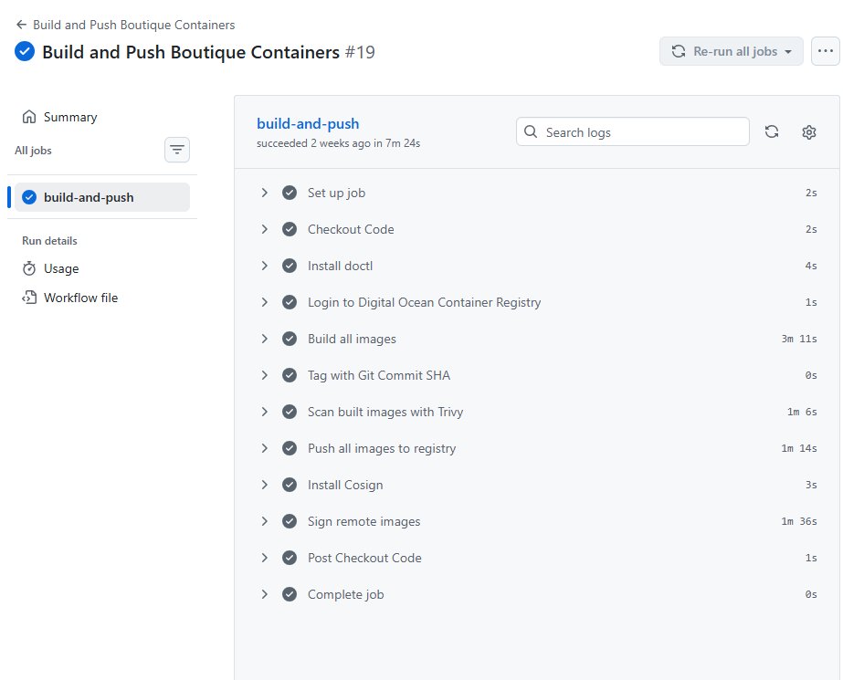
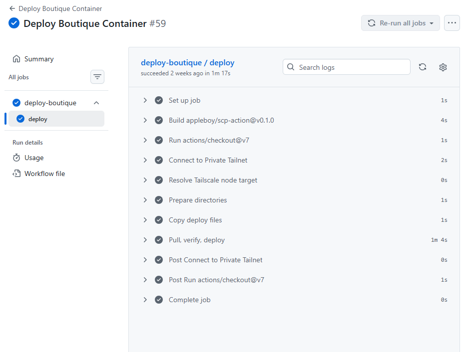
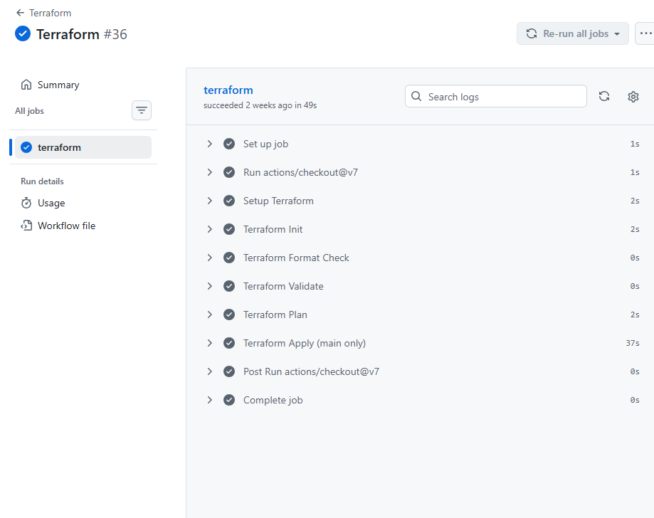

# 00 — Prologue: The Briefing

*Or: How I Took a Google Demo and Made It Talk to Strangers Safely*




*The GitHub Actions pipeline showing all green checks*

---

## The Call

It started with a repo. Not even a real repo — just a folder full of source code, copied from Google's "Online Boutique" demo (formerly known as `microservices-demo`). Ten microservices, each written in a different language, doing a very convincing impression of an e-commerce store.

The mission? Deploy this thing on a single DigitalOcean Droplet, but here's the kicker — **bake security into every layer from the start.**

No retrofitting. No "we'll fix it in prod." No "that's a problem for future me."

## The Brief

| Item | Value |
|------|-------|
| **The App** | Google's Online Boutique — 10 services + 1 load generator |
| **The Target** | 1x DO Droplet (s-2vcpu-4gb), nyc3 |
| **The Domain** | `suworks.me` (Namecheap → DO DNS) |
| **The Tools** | Terraform, Docker Compose, Caddy, Tailscale, Cosign |
| **The Pipeline** | GitHub Actions (PR checks → build → sign → push → deploy) |
| **The Mandate** | Zero ClickOps. Full automation. Security first. |

## What We Were Actually Deploying

For context, here's what "Online Boutique" actually is:

A fake store selling fake products with fake money. You browse, you add to cart, you "check out" with a simulated credit card charge. No real inventory, no real payments, no real emails (the email service runs in "dummy mode" and just logs).

But under the hood, it's an 10-service polyglot microservice architecture:

| Service | Language | What It Does |
|---------|----------|-------------|
| frontend | Go | The storefront — the only service users see |
| cartservice | C# (.NET) | Shopping cart backed by Redis |
| productcatalogservice | Go | Product listings from a JSON file |
| currencyservice | Node.js | Currency conversion |
| paymentservice | Node.js | Simulated credit card processing |
| shippingservice | Go | Shipping quotes and tracking |
| emailservice | Python | "Sends" order confirmations (logs them) |
| checkoutservice | Go | The orchestrator — coordinates the entire checkout |
| recommendationservice | Python | Random product suggestions (not ML, it's random) |
| adservice | Java | Returns ads based on context |
| loadgenerator | Python/Locust | Simulates user traffic (on-demand) |

Every service communicates via gRPC. The frontend is the sole HTTP gateway. Everything else is gRPC behind it.

## The Starting Point (A.K.A. The Security Horror Show)

Before we touched anything, here's what the original demo shipped with:

```
✔️ All inter-service gRPC traffic — PLAINTEXT, no TLS
✔️ No authentication — a "session" is just a UUID cookie
✔️ Credit card data flowing through 3 services in plaintext protobuf
✔️ Containers running as root by default
✔️ No resource limits — one runaway service could crash the Droplet
✔️ No health checks — Docker didn't know if services were alive
✔️ No rate limiting — a Locust DoS would flatten the frontend
✔️ Untagged base images — non-deterministic builds from the start
```

Every single one of these got fixed.

## The War Room

This documentation is the story of that journey. Not a sanitized post-mortem — a raw, real-time account of every bug, every wrong turn, every "why the hell is this not working" moment, and exactly how each one got put down.

If you're reading this to understand the architecture: read sequentially.
If you're reading this because something broke and you need to fix it: jump straight to **08 — The Bugs Gallery**.

Let's begin.

---

**Next: [01 — Terraform: The Birth of Infrastructure](01-terraform-the-birth-of-infrastructure.md)**
