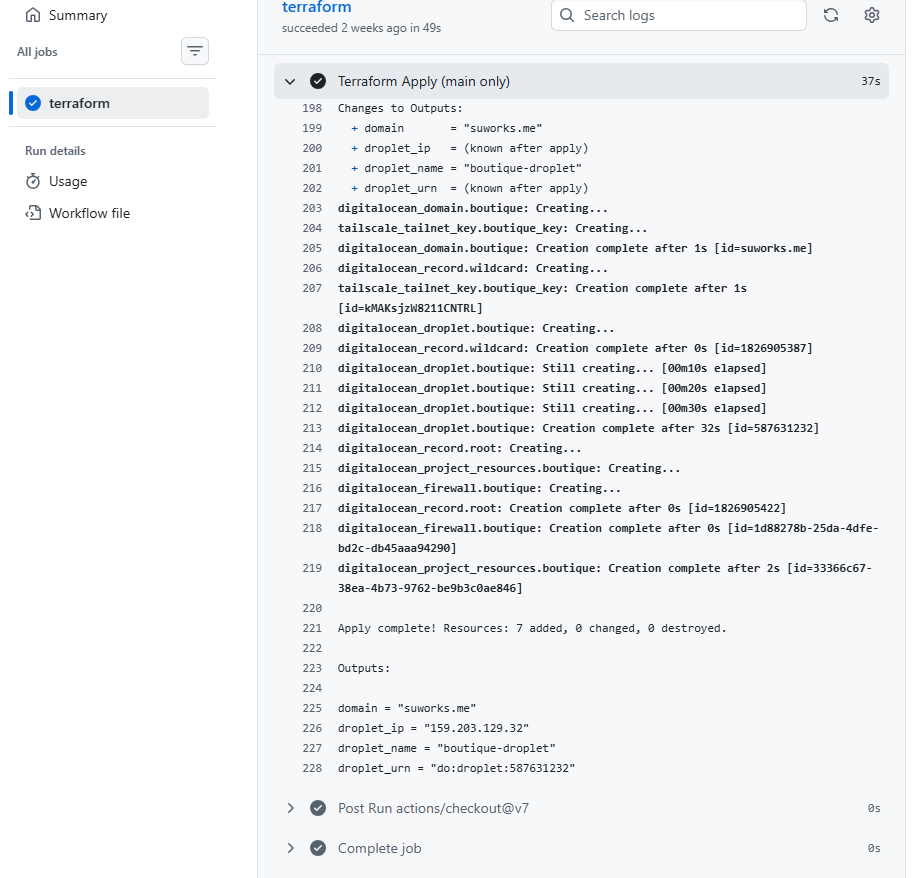

# 01 — Terraform: The Birth of Infrastructure

*Or: How I Learned to Stop Worrying and Love the State File*


*`terraform apply` output showing 7 resources created*

---

## The Philosophy

Terraform isn't just "the thing that makes the server." It's the **source of truth.** Every resource that powers this deployment — the Droplet, the firewall, the DNS records, the SSH keys, the Tailscale auth key — is defined in code and managed through state. If it's not in Terraform, it doesn't exist. If it gets destroyed, Terraform recreates it. If someone clicks a button in the DO console, Terraform reverts it on the next apply.

This is the IaC covenant: **what you see in the code is what's running in the cloud.**

## The Layout

```
terraform/
├── provider.tf          ← DO + Tailscale providers
├── backend.tf           ← DO Spaces (S3-compatible) for state
├── variables.tf         ← All inputs: tokens, region, sizes, keys
├── main.tf              ← SSH key data source
├── droplet.tf           ← The Droplet + Tailscale auth key
├── firewall.tf          ← DO Cloud Firewall rules
├── dns.tf               ← Domain + A records for suworks.me
├── outputs.tf           ← Droplet IP, name, domain, URN
├── cloud-init.yaml      ← User data script for first boot
├── terraform.tfvars     ← Local vars (gitignored)
└── terraform.tfvars.example
```

## Remote State — DO Spaces

The state file is the most critical piece of Terraform. Lose it, and Terraform doesn't know what it manages. The original design used DO Spaces (S3-compatible object storage) as the remote backend:

```hcl
terraform {
  backend "s3" {
    bucket                      = "idp-tf"
    key                         = "boutique/terraform.tfstate"
    region                      = "us-east-1"
    endpoint                    = "https://nyc3.digitaloceanspaces.com"
    skip_credentials_validation = true
    skip_requesting_account_id  = true
    skip_metadata_api_check     = true
    force_path_style            = true
  }
}
```

**The Bug:** The bucket name in `backend.tf` was originally `allbuckets-1784635195040` — a generic name from an existing Space. It should have been `idp-tf`, matching the Space created for this project. First `terraform init` failed quietly. Fixed it on the second pass.

## The Providers

Two providers, two distinct roles:

### DigitalOcean Provider

```hcl
provider "digitalocean" {
  # Token from DIGITALOCEAN_TOKEN env var
}
```

Handles the Droplet, firewall, DNS, Spaces, and project resources. All configured via environment variables and `TF_VAR_*` prefixes.

### Tailscale Provider

```hcl
provider "tailscale" {
  oauth_client_id     = var.ts_client_id
  oauth_client_secret = var.ts_client_secret
}
```

This was our first major debate. The Tailscale provider uses OAuth, not an API key. You create an OAuth client in Tailscale's admin console with specific scopes:

- **Devices → Core → Write** — needed to create auth keys that register devices
- **Keys → Auth Keys → Write** — needed to generate the one-time auth key

The OAuth client also needs a **tag** assigned. We created `tag:boutique-servers` specifically for this.

## The Droplet

The core resource. Ubuntu 24.04, nyc3, s-2vcpu-4gb:

```hcl
resource "digitalocean_droplet" "boutique" {
  image      = "ubuntu-24-04-x64"
  name       = var.droplet_name
  region     = var.region
  size       = var.droplet_size
  ssh_keys   = [var.ssh_fingerprint]
  user_data  = templatefile("${path.module}/cloud-init.yaml", {
    tailscale_authkey = tailscale_tailnet_key.boutique_key.key
    droplet_name      = var.droplet_name
    spaces_key        = var.do_spaces_access_key
    spaces_secret     = var.do_spaces_secret_key
  })
  monitoring = true
}
```

The `user_data` field passes the cloud-init script that runs on first boot. This is where Tailscale, Docker, UFW, and Cosign all get installed. More on that in **06 — Cloud Init**.

## The Tailscale Auth Key

```hcl
resource "tailscale_tailnet_key" "boutique_key" {
  reusable      = true
  ephemeral     = true
  preauthorized = true
  expiry        = 3600
  tags          = ["tag:boutique-servers"]
}
```

This was a war zone. See **04 — Tailscale** for the full story. The short version:

- `reusable = true`: The key can be used more than once. `false` means one-time use, which broke because the key was consumed before cloud-init could use it.
- `ephemeral = true`: The device is automatically removed from the tailnet when it disconnects. `false` would leave stale entries.
- `preauthorized = true`: No need to approve the device from the admin console.
- `expiry = 3600`: The key self-destructs after 1 hour. If the droplet takes longer than that to boot, the key is dead.

## The Firewall

```hcl
resource "digitalocean_firewall" "boutique" {
  droplet_ids = [digitalocean_droplet.boutique.id]

  inbound_rule {
    protocol         = "tcp"
    port_range       = "22"
    source_addresses = ["0.0.0.0/0", "::/0"]
  }
  inbound_rule {
    protocol         = "tcp"
    port_range       = "80"
    source_addresses = ["0.0.0.0/0", "::/0"]
  }
  inbound_rule {
    protocol         = "tcp"
    port_range       = "443"
    source_addresses = ["0.0.0.0/0", "::/0"]
  }
}
```

Wait — port 22 is open to the world here? Yes, at the DO Cloud Firewall level. The real lockdown happens at the UFW level inside the droplet (see **06 — Cloud Init**). This is defense in depth: the cloud firewall allows SSH broadly, but UFW on the droplet blocks it on the public interface and only allows it through Tailscale.

**Checkov warning:** This triggered `CKV_DIO_4` ("firewall ingress should not be wide open"). We acknowledged it as an intentional exception — the store is public by design.

## The DNS

```hcl
resource "digitalocean_domain" "boutique" {
  name = var.domain_name  # suworks.me
}
resource "digitalocean_record" "root" {
  domain = digitalocean_domain.boutique.name
  type   = "A"
  name   = "@"
  value  = digitalocean_droplet.boutique.ipv4_address
}
```

**Prerequisite:** Namecheap must point its nameservers to DigitalOcean:
```
ns1.digitalocean.com
ns2.digitalocean.com
ns3.digitalocean.com
```

Without this, DO can't manage DNS for `suworks.me`.

## The SSH Key

The `ssh_fingerprint` variable references a key uploaded to DO's control panel. The actual fingerprint looks like `77:c4:ad:48:d9:6f:00:fb:07:9a:ea:f5:21:33:27:a0`.

**The Bug:** The SSH key in cloud-init had a typo — `ssh-ed25519` was written as `ssh-ed2551` (missing a digit). This made the key invalid, and SSH authentication failed on first boot. Took a full droplet rebuild to catch.

## Outputs

```hcl
output "droplet_ip"   { value = digitalocean_droplet.boutique.ipv4_address }
output "droplet_name" { value = digitalocean_droplet.boutique.name }
output "domain"       { value = var.domain_name }
output "droplet_urn"  { value = digitalocean_droplet.boutique.urn }
```

These feed into the deploy workflow and the disaster recovery pipeline.

## How to Reproduce

```bash
cd terraform
terraform init
terraform plan
terraform apply -auto-approve
```

That's it. Six resources created:

1. Tailscale auth key
2. DigitalOcean Droplet
3. DO Domain (suworks.me)
4. DO Firewall
5. A record (@ → Droplet IP)
6. Wildcard CNAME record
7. Project resource assignment

## The War Story: SSH Key Fingerprint

**The error:** `Permission denied (publickey)` when trying to SSH into a newly created droplet.

**The debugging:** The SSH key was uploaded to DO, the fingerprint was in `variables.tf`, and the key was in `ssh_keys`. Everything looked right. But `ssh boutique@<ip>` refused the connection.

**The cause:** The cloud-init file had `ssh_authorized_keys` pointing to the public key content, but we'd also passed it via `ssh_keys = [var.ssh_fingerprint]`. The DO-level key injection worked, but cloud-init's user creation overrode the authorized_keys file. The solution was to remove the SSH key from cloud-init's `users:` block and let DO handle it natively.

**The actual fix:** We kept the key in `ssh_keys` and removed the `ssh_authorized_keys` line from cloud-init. But later, cloud-init needed it for the boutique user (not root). So we kept both, ensuring the fingerprints matched.

---

**Next: [02 — Docker Compose: The Orchestra](02-docker-compose-the-orchestra.md)**
