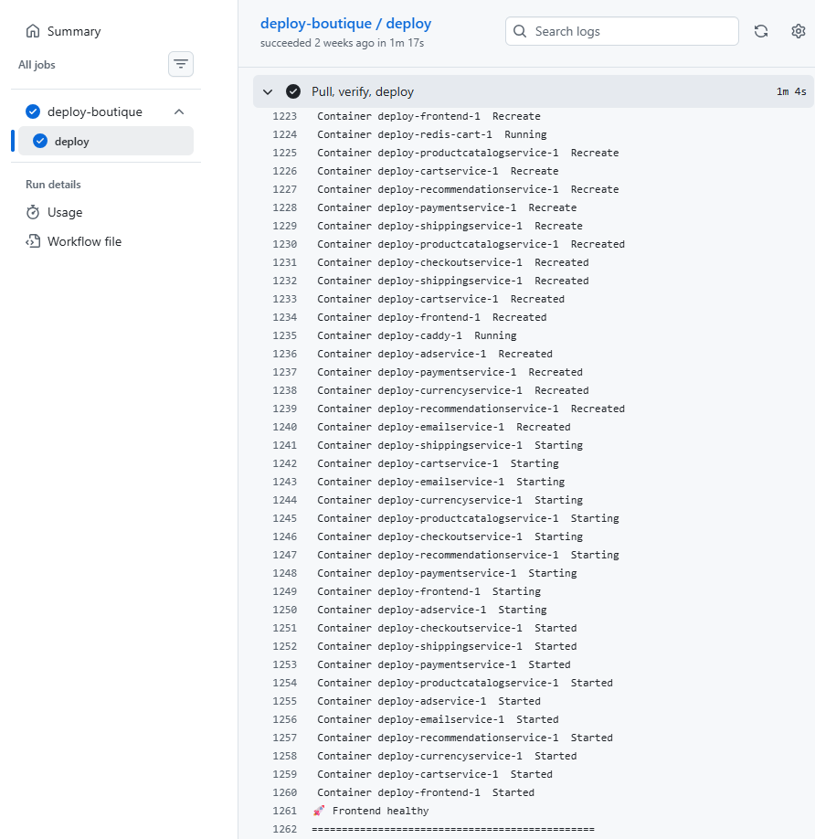

# 02 — Docker Compose: The Orchestra

*Or: How 12 Containers Learned to Share a Single Droplet*


*`docker ps` showing all 12 containers healthy*

---

## The Architecture

Eleven services + Redis + Caddy, all on one Droplet. That's 13 containers competing for 4GB RAM and 2 vCPUs. Every resource decision had to be deliberate.

## The File

`deploy/docker-compose.yml` is the single source of truth for the entire runtime stack. It defines:

- Which images to use (and where to pull them from)
- Which networks each service belongs to
- Which ports are exposed (and which ones aren't)
- Environment variables for service discovery
- Resource limits (no more runaway containers)
- Health checks (Docker knows if a service is alive)
- Security options (read-only rootfs, capability dropping)

## The Service Discovery Problem

Every service needs to know where every other service lives. The original Google demo solved this with environment variables:

```yaml
frontend:
  environment:
    PRODUCT_CATALOG_SERVICE_ADDR: "productcatalogservice:3550"
    CURRENCY_SERVICE_ADDR: "currencyservice:7000"
    CART_SERVICE_ADDR: "cartservice:7070"
    RECOMMENDATION_SERVICE_ADDR: "recommendationservice:8080"
    CHECKOUT_SERVICE_ADDR: "checkoutservice:5050"
    SHIPPING_SERVICE_ADDR: "shippingservice:50051"
    AD_SERVICE_ADDR: "adservice:9555"
```

Docker Compose's internal DNS resolves service names to container IPs. So `productcatalogservice` resolves to the IP of the `productcatalogservice` container. No hardcoded IPs, no service registry, no DNS changes. It just works.

## The Image Registry

Every built image is pushed to DO Container Registry:

```yaml
services:
  frontend:
    build: ../src/frontend
    image: registry.digitalocean.com/idpreg/frontend:latest
```

The `build` key tells Docker Compose how to build it. The `image` key tells it where to push and pull. This dual-purpose means the same file works for both local development and CI/CD.

## The Three Networks (Originally)

The original design had three Docker networks:

```yaml
networks:
  boutique-net:
    driver: bridge
    internal: false    # Can reach the internet
  backend-net:
    driver: bridge
    internal: true     # No internet access
  data-tier:
    driver: bridge
    internal: true     # No internet access
```

**The Logic:**

- `boutique-net`: Caddy, frontend, loadgenerator — services that need internet access
- `backend-net`: All backend gRPC services — no internet, only talk to each other
- `data-tier`: Redis — only cartservice can reach it

**The Bug:** This was over-engineering. Cartservice needs to reach Redis AND the other backends, so it had to be on both `backend-net` AND `data-tier`. But services on `backend-net` can't reach `data-tier`, so Redis was isolated from everything except cartservice. This broke the checkout flow because checkoutservice can't read cart data directly.

**The Fix:** Collapsed to two networks:

```yaml
networks:
  boutique-net:
    driver: bridge
    internal: false
  backend-net:
    driver: bridge
    internal: true
```

Redis moved to `backend-net`. All backend services live there. Frontend bridges both. Caddy lives on `boutique-net` only. Much simpler, still secure.

## The Caddyfile Bind Mount

```yaml
caddy:
  volumes:
    - caddy_config:/config
    - caddy_data:/data
    - ./Caddyfile:/etc/caddy/Caddyfile:ro
```

**The Bug:** The `:ro` at the end makes the Caddyfile read-only inside the container. Caddy can reload it, but `caddy fmt --overwrite` can't write back to it. When we tried to auto-format the Caddyfile from inside the container (during the CSP fix), it failed with:

```
Error: overwriting formatted file: open /etc/caddy/Caddyfile: read-only file system
```

**The Workaround:** Edit the Caddyfile on the host, then `docker exec deploy-caddy-1 caddy reload`.

## Resource Limits — No More Runaway Containers

Every service got explicit limits:

```yaml
frontend:
  deploy:
    resources:
      limits:
        memory: 256M
        cpus: "0.5"
      reservations:
        memory: 128M
```

| Service | Memory Limit | CPU Limit |
|---------|-------------|-----------|
| Caddy | 256M | 0.5 |
| Redis | 256M | 0.5 |
| Frontend | 256M | 0.5 |
| Cartservice | 512M | 1.0 |
| Adservice | 512M | 1.0 |
| Product Catalog | 256M | 0.5 |
| Shipping | 256M | 0.5 |
| Checkout | 256M | 0.5 |
| Currency | 128M | 0.25 |
| Payment | 128M | 0.25 |
| Email | 128M | 0.25 |
| Recommendation | 128M | 0.25 |

Total maximum: ~3GB of 4GB available. Headroom for spikes.

## Health Checks — Because Docker Should Know

```yaml
caddy:
  healthcheck:
    test: ["CMD", "curl", "-f", "http://localhost:2019/config"]
    interval: 1m30s
    timeout: 30s
    retries: 5
    start_period: 30s
```

**The Bug:** Several services use `distroless/static` base images which don't include `curl`. Health checks on those services would always fail:

```
healthcheck.test must start with "CMD", "CMD-SHELL" or "NONE"
```

**The Fix:** Disable health checks on distroless-based services:

```yaml
frontend:
  healthcheck:
    disable: true
```

Services that CAN health-check: Caddy (has curl), Redis (has redis-cli), emailservice (Python), paymentservice (Node.js), currencyservice (Node.js), recommendationservice (Python), adservice (Java), loadgenerator (Python).

Services that CAN'T: frontend (distroless), cartservice (.NET distroless), productcatalogservice (distroless), shippingservice (distroless), checkoutservice (distroless).

## The `cap_drop: ALL` Saga

Every service got the security treatment:

```yaml
frontend:
  cap_drop:
    - ALL
  cap_add:
    - NET_BIND_SERVICE
```

This drops every Linux capability and only adds back what's absolutely needed. `NET_BIND_SERVICE` lets the service bind to ports under 1024.

**The Bug:** Redis also got `cap_drop: ALL`. Redis's entrypoint needs `CHOWN`, `SETUID`, and `SETGID` to initialize its data directory and switch to the `redis` user. Without these, Redis crashed instantly:

```
Restarting (127) — command not found
```

**The Fix:** Removed `cap_drop` from Redis entirely. A data store needs standard OS operations. The security risk is minimal since Redis is on an internal network.

## The Authentication Saga

**The Bug:** The deploy script wrote the `.env` file using `sudo tee`, which created it as `root:root`. The `boutique` user couldn't read it:

```
open /opt/boutique/deploy/.env: permission denied
```

**The Fix:**
```yaml
echo "${{ secrets.BOUT_ENV_FILE }}" | sudo tee /opt/boutique/deploy/.env > /dev/null
sudo chmod 600 /opt/boutique/deploy/.env
sudo chown boutique:boutique /opt/boutique/deploy/.env
```

## The `DOCR` Environment Variable Gap

**The Bug:** The workflow defined `DOCR: registry.digitalocean.com/idpreg` at the top level, but this variable doesn't propagate through SSH. When the deploy script ran on the droplet:

```bash
docker pull "$DOCR/frontend:$SHA_TAG"
```

`$DOCR` was empty, so it tried to pull from Docker Hub:

```
Error response from daemon: pull access denied, repository does not exist or may require 'docker login'
```

**The Fix:** Hardcoded the registry URL in the SSH script:

```bash
export DOCR=registry.digitalocean.com/idpreg
docker pull "$DOCR/frontend:$SHA_TAG"
```

---

**Next: [03 — Caddy: The Bouncer at the Door](03-caddy-the-bouncer-at-the-door.md)**
